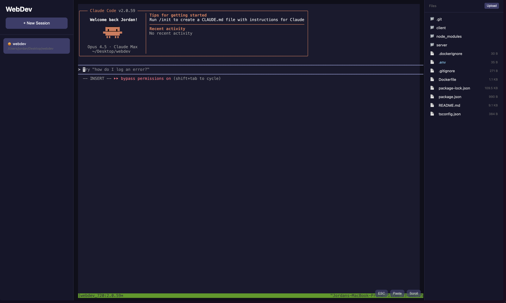
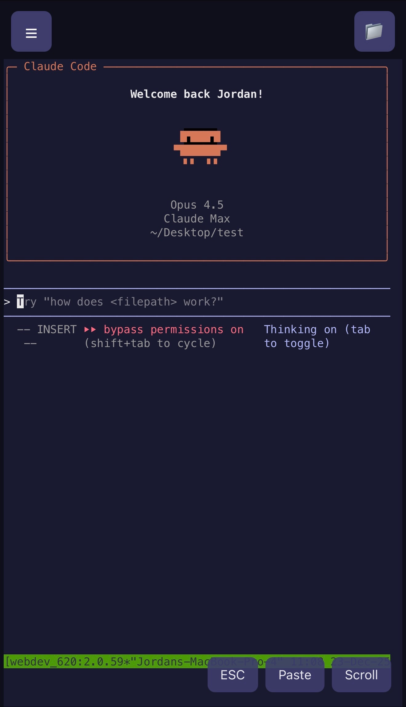

# WebDev

Your AI coding agent in the browser.

## Overview

WebDev is a browser-based interface for managing AI coding agents. It uses `tmux` under the hood to persist sessions, allowing you to disconnect and reconnect without losing context.

**Supported agents:** Claude Code, Codex, and Gemini CLI.

WebDev is fully responsive, making it a great tool for mobile sessions.





## How to Run

### Development

```bash
npm install && cd client && npm install && cd .. && npm run dev
```

#### Development Notes

- The Vite dev server runs on port 3000 (`client/vite.config.ts`).
- The API/WebSocket server should run on a different port (typically 8000). Set `PORT=8000` in `.env` or your shell, or update the Vite proxy target if you choose a different port.

### Production

```bash
npm run build && npm run start
```

## Configuration

Environment variables (set in `.env`):

| Variable | Description | Default |
|----------|-------------|---------|
| `PORT` | Server port | `3000` |
| `APP_NAME` | Name shown in UI | `WebDev` |
| `SESSIONS_PATH` | Path to sessions JSON | `~/.webdev/sessions.json` |
| `BROWSE_ROOT` | Root directory for browser | `/` |
| `CLAUDE_DIR` | Claude config directory | `~/.claude` |
| `CODEX_HOME` | Codex config directory | `~/.codex` |
| `GEMINI_DIR` | Gemini config directory | `~/.gemini` |

## Claude Code Hooks (Activity Indicator)

WebDev can show a pulsing indicator on sessions when Claude is actively processing. This works via Claude Code hooks that call the WebDev API.

### Setup

**1. Create the hook script at `~/.claude/hooks/set-active.sh`:**

```bash
#!/bin/bash
ACTIVE=${1:-false}
SESSION_NAME=$(tmux display-message -p '#S' 2>/dev/null)
SESSION_ID=${SESSION_NAME#webdev-}

# Only call API if we're in a webdev tmux session
if [[ -n "$SESSION_ID" && "$SESSION_ID" != "$SESSION_NAME" ]]; then
  curl -s -X PATCH "http://localhost:3000/api/sessions/$SESSION_ID/active" \
    -H "Content-Type: application/json" \
    -d "{\"active\": $ACTIVE}" \
    --max-time 5 \
    >/dev/null 2>&1
fi

exit 0
```

**2. Make it executable:**

```bash
chmod +x ~/.claude/hooks/set-active.sh
```

**3. Add hooks to `~/.claude/settings.json`:**

```json
{
  "hooks": {
    "UserPromptSubmit": [
      {
        "hooks": [
          {
            "type": "command",
            "command": "~/.claude/hooks/set-active.sh true"
          }
        ]
      }
    ],
    "Stop": [
      {
        "hooks": [
          {
            "type": "command",
            "command": "~/.claude/hooks/set-active.sh false"
          }
        ]
      }
    ]
  }
}
```

**4. Restart Claude Code** for the hooks to take effect.

### How It Works

- `UserPromptSubmit` fires when you send a prompt → sets `active: true` → badge pulses
- `Stop` fires when Claude finishes responding → sets `active: false` → badge stops pulsing
- The hook detects if it's running inside a `webdev-*` tmux session and extracts the session ID
- Sessions outside WebDev are silently ignored

### API Endpoint

| Method | Endpoint | Body | Description |
|--------|----------|------|-------------|
| `PATCH` | `/api/sessions/:id/active` | `{ "active": true }` | Set session active state |

## Operational Notes

- tmux session names are `webdev-<sessionId>` (useful for manual inspection/cleanup).

## Themes

- Dark and light themes are defined in `client/src/lib/themes.ts` (UI CSS variables + terminal colors).
- Toggle between themes using the sun/moon button in the sidebar footer.
- Theme preference is stored in `localStorage` under `webdev.theme`.

## How It Works

### Sessions

- Each session is stored in `~/.webdev/sessions.json`
- Sessions track: name, directory, CLI type, and options
- Creating a session spawns a tmux session with the CLI running inside
- Closing the browser detaches from tmux; the CLI keeps running
- Reopening a session reattaches to the existing tmux session

### Terminal

- Uses xterm.js in the browser for terminal rendering
- WebSocket connection streams data between browser and server
- Server uses node-pty to create PTY processes that attach to tmux
- Supports resize, copy/paste, and full terminal emulation

### File Browser

- Shows files in the session's working directory
- Auto-refreshes when files change (via chokidar watcher)
- Syntax highlighting for code files (Prism.js)
- Special handling for `.env` files (dedicated editor)

---

## Development

### Architecture

```
┌─────────────────────────────────────────────────────────┐
│                      Browser                            │
│  ┌─────────────┐  ┌─────────────┐  ┌─────────────────┐  │
│  │   Sidebar   │  │  Terminal   │  │  File Browser   │  │
│  │  (Sessions) │  │   (xterm)   │  │                 │  │
│  └─────────────┘  └──────┬──────┘  └─────────────────┘  │
└──────────────────────────┼──────────────────────────────┘
                           │ WebSocket
┌──────────────────────────┼──────────────────────────────┐
│                   Express Server                        │
│  ┌─────────────┐  ┌──────┴──────┐  ┌─────────────────┐  │
│  │   Routes    │  │  node-pty   │  │  Session Store  │  │
│  │   (API)     │  │  (PTY)      │  │  (JSON)         │  │
│  └─────────────┘  └──────┬──────┘  └─────────────────┘  │
└──────────────────────────┼──────────────────────────────┘
                           │
┌──────────────────────────┼──────────────────────────────┐
│                        tmux                             │
│  ┌─────────────┐  ┌─────────────┐  ┌─────────────────┐  │
│  │  Session 1  │  │  Session 2  │  │    Session N    │  │
│  │  (claude)   │  │   (codex)   │  │    (gemini)     │  │
│  └─────────────┘  └─────────────┘  └─────────────────┘  │
└─────────────────────────────────────────────────────────┘
```

### Project Structure

```
webdev/
├── server/
│   ├── index.ts           # Express server + WebSocket
│   ├── routes.ts          # API route handlers
│   ├── types/             # TypeScript types
│   └── lib/
│       ├── cli/           # CLI definitions (claude, codex, gemini)
│       ├── sessions.ts    # Session CRUD
│       ├── files.ts       # File operations
│       ├── config.ts      # App configuration
│       ├── constants.ts   # Shared constants
│       └── validators.ts  # Zod schemas
├── client/
│   ├── src/
│   │   ├── App.tsx        # Main UI
│   │   ├── components/
│   │   │   ├── Terminal.tsx         # xterm.js terminal
│   │   │   ├── FileBrowser.tsx      # File tree viewer
│   │   │   ├── DirectoryBrowser.tsx # Directory picker
│   │   │   └── EnvEditor.tsx        # .env file editor
│   │   ├── lib/           # Client utilities
│   │   ├── styles/        # CSS modules
│   │   └── types/         # Client types
│   └── vite.config.ts     # Vite configuration
└── package.json
```

### CLI Integration

CLIs are defined in `server/lib/cli/`:

| CLI | Resume Detection | Auto-Approve Flag |
|-----|------------------|-------------------|
| Claude Code | `~/.claude/projects/` | `--dangerously-skip-permissions` |
| Codex | `~/.codex/sessions/` | `--dangerously-bypass-approvals-and-sandbox` |
| Gemini CLI | `~/.gemini/tmp/<hash>/chats/` | `-y` (YOLO mode) |

Each CLI implements:
- `getOptions()` - Returns available CLI flags
- `buildCommand()` - Builds the command for new sessions
- `buildResumeCommand()` - Builds command when reattaching (auto-adds resume flags)
- `shouldResume()` - Checks if existing conversation exists

To add a new CLI, create a new file in `server/lib/cli/`, implement the `CLI` interface, and register it in `index.ts`.

### API Endpoints

#### Sessions

| Method | Endpoint | Description |
|--------|----------|-------------|
| `GET` | `/api/sessions` | List all sessions |
| `POST` | `/api/sessions` | Create a new session |
| `GET` | `/api/sessions/:id` | Get a specific session |
| `PATCH` | `/api/sessions/:id` | Update session (rename) |
| `DELETE` | `/api/sessions/:id` | Delete a session |

**Create Session Body:**
```json
{
  "name": "my-project",
  "directory": "/path/to/project",
  "executable": "claude",
  "options": ["dangerously-skip-permissions"]
}
```

#### Files

| Method | Endpoint | Description |
|--------|----------|-------------|
| `GET` | `/api/sessions/:id/files?mode=tree` | Get file tree for session directory |
| `GET` | `/api/sessions/:id/files?mode=content&path=...` | Read file content |
| `POST` | `/api/sessions/:id/files` | Upload a file (multipart/form-data) |

#### Environment Files

| Method | Endpoint | Description |
|--------|----------|-------------|
| `GET` | `/api/sessions/:id/env?path=...` | Read .env file |
| `PUT` | `/api/sessions/:id/env?path=...` | Write .env file |
| `GET` | `/api/sessions/:id/env/exists?path=...` | Check if .env file exists |

**Write Env Body (structured):**
```json
{
  "vars": {
    "API_KEY": "xxx",
    "DEBUG": "true"
  }
}
```

**Write Env Body (raw):**
```json
{
  "raw": "API_KEY=xxx\nDEBUG=true"
}
```

#### Directory Browser

| Method | Endpoint | Description |
|--------|----------|-------------|
| `GET` | `/api/browse?path=...` | List directory contents |
| `POST` | `/api/browse/folder` | Create a new folder |

**Create Folder Body:**
```json
{
  "parentPath": "/path/to/parent",
  "name": "new-folder"
}
```

#### CLI & Config

| Method | Endpoint | Description |
|--------|----------|-------------|
| `GET` | `/api/executables` | List available CLIs and their options |
| `GET` | `/api/config` | Get app configuration |
| `GET` | `/api/conversation-exists?directory=...&executable=...` | Check if conversation exists |
| `GET` | `/api/tmux/mouse` | Get tmux mouse mode status |
| `POST` | `/api/tmux/mouse` | Toggle tmux mouse mode |

#### WebSocket

| Endpoint | Description |
|----------|-------------|
| `/ws/terminal/:sessionId` | Terminal WebSocket connection (spawns/attaches tmux) |
| `/ws/files/:sessionId` | File watcher subscription only (no tmux) |
| `/ws/sessions` | Session list subscription |

**WebSocket Messages (Client → Server):**
```json
{ "type": "input", "data": "ls -la\n" }
{ "type": "resize", "cols": 80, "rows": 24 }
{ "type": "subscribe-files" }
```

**WebSocket Messages (Server → Client):**
```json
{ "type": "output", "data": "..." }
{ "type": "exit", "code": 0 }
{ "type": "error", "message": "..." }
{ "type": "files-changed" }
```
